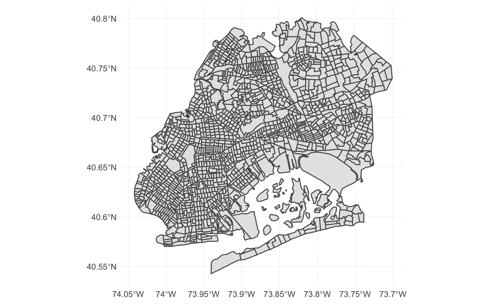
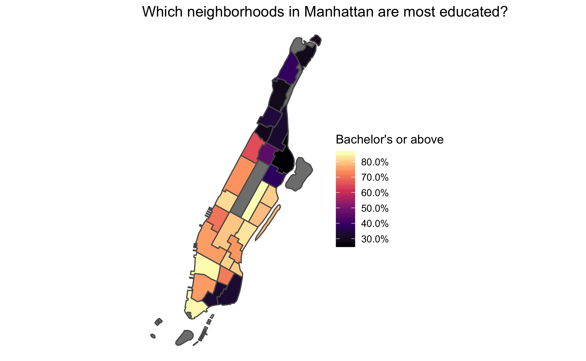

<!-- README.md is generated from README.Rmd. Please edit that file -->

# nycgeo

[](https://travis-ci.org/mfherman/nycgeo)
[](https://www.tidyverse.org/lifecycle/#experimental)
[](https://cran.r-project.org/package=nycgeo)

The `nycgeo` package contains spatial data files for various geographic
and administrative boundaries in New York City. Data is in the [`sf`
(simple features)](https://r-spatial.github.io/sf/) format and includes
boundaries for boroughs (counties), public use microdata areas (PUMAs),
neighborhood tabulation areas (NTAs), and census tracts. In the future,
more boundaries will be added, such as community districts, census
blocks, and city council districts.

The spatial files contained in the `nycgeo` package are available on
websites such as the [New York City Department of City Planning’s Bytes
of the Big
Apple](https://www1.nyc.gov/site/planning/data-maps/open-data.page#district_political)
and the [U.S. Census Bureau TIGER/Line®
Shapefiles](https://www.census.gov/geo/maps-data/data/tiger-line.html),
but this package aims to make accessing the spatial data more
convenient. Instead of downloading and converting shapefiles each time
you need them, `nycgeo` provides the files in a consistent format (`sf`)
with added metadata that enable joins with non-spatial data.

In addition, selected demographic, social, and economic estimates from
the U.S. Census Bureau American Community Survey can be added to the
geographic boundaries in `nycgeo`, allowing for contextualization and
easy choropleth mapping.

Finally, `nycgeo` makes it simple to access a subset of spatial data in
a particular geographic area, such as all census tracts in Brooklyn and
Queens.

## Installation

You can install `nycgeo` from
[GitHub](https://https://github.com/mfherman/nycgeo) with:

``` r
remotes::install_github("mfherman/nycgeo")
```

## Examples

### Basic Usage

The most basic usage of `nycgeo` is to get boundaries in the `sf`
format. Use `nyc_tracts()`, `nyc_pumas()`, or `nyc_ntas()` to get your
desired geography. To make best use of the package, you should also load
the `sf` package when using `nycgeo`. For these examples, I’ll also load
`tidyverse` as this will allow us to take advantage of pretty `tibble`
printing and will come in handy when we want to manipulate and map the
spatial data later.

``` r
library(nycgeo)
library(sf)
library(tidyverse)

nyc_tracts()
#> Simple feature collection with 2166 features and 12 fields
#> geometry type:  MULTIPOLYGON
#> dimension:      XY
#> bbox:           xmin: 913180.2 ymin: 120131.4 xmax: 1067382 ymax: 272798.5
#> epsg (SRID):    2263
#> proj4string:    +proj=lcc +lat_1=41.03333333333333 +lat_2=40.66666666666666 +lat_0=40.16666666666666 +lon_0=-74 +x_0=300000.0000000001 +y_0=0 +ellps=GRS80 +towgs84=0,0,0,0,0,0,0 +units=us-ft +no_defs
#> # A tibble: 2,166 x 13
#>    boro_tract_id geoid state_fips county_fips tract_id county_name
#>    <chr>         <chr> <chr>      <chr>       <chr>    <chr>      
#>  1 1000100       3606… 36         061         000100   New York   
#>  2 1000201       3606… 36         061         000201   New York   
#>  3 1000202       3606… 36         061         000202   New York   
#>  4 1000500       3606… 36         061         000500   New York   
#>  5 1000600       3606… 36         061         000600   New York   
#>  6 1000700       3606… 36         061         000700   New York   
#>  7 1000800       3606… 36         061         000800   New York   
#>  8 1000900       3606… 36         061         000900   New York   
#>  9 1001001       3606… 36         061         001001   New York   
#> 10 1001002       3606… 36         061         001002   New York   
#> # ... with 2,156 more rows, and 7 more variables: boro_name <chr>,
#> #   boro_id <chr>, nta_id <chr>, nta_name <chr>, puma_id <chr>,
#> #   puma_name <chr>, geometry <MULTIPOLYGON [US_survey_foot]>
```

### Filter by geography

If you don’t need census tracts for the entire city, you can use the
`filter_by` and `region` arguments of `nyc_tracts()` to specify the area
you are interested in. For example, the following code returns only
census tracts in Brooklyn and Queens.

``` r
bk_qn_tracts <- nyc_tracts(
  filter_by = "borough",
  region = c("brooklyn", "queens")
  )

ggplot(bk_qn_tracts) +
  geom_sf() +
  theme_minimal()
```



Note, you can select multiple regions by passing a character vector to
the `region` argument, but you can only select a single geography to
`filter_by`. Additionally, you can only filter by a geography that is
*larger than or equal to* the boundaries you request. For example, it is
not possible to filter PUMAs by NTAs because NTAs are smaller than
PUMAs.

### Adding American Community Survey Data

`nycgeo` includes selected estimates from the American Community Survey
as datasets. You can access these datasets directly or have them
appended to the spatial data. To print a `tibble` of ACS data, simply
call the data you want.

``` r
ntas_acs_data
#> # A tibble: 195 x 27
#>    nta_id pop_total_est pop_total_moe pop_white_est pop_white_moe
#>    <chr>          <dbl>         <dbl>         <dbl>         <dbl>
#>  1 BK09           24212          891.         17734          859.
#>  2 BK17           67681         1736.         43146         1449.
#>  3 BK19           35811         1388.         24817         1139.
#>  4 BK21           31132         1268.          9804          894.
#>  5 BK23           16436          707.         15380          698.
#>  6 BK25           45031         1498.         33709         1346.
#>  7 BK26           30828         1480.         14676          961.
#>  8 BK27           32808         1293.         14483          863.
#>  9 BK28           93114         2087.         38709         1559.
#> 10 BK29           66055         1757.         29318         1293.
#> # ... with 185 more rows, and 22 more variables: pop_white_pct_est <dbl>,
#> #   pop_white_pct_moe <dbl>, pop_black_est <dbl>, pop_black_moe <dbl>,
#> #   pop_black_pct_est <dbl>, pop_black_pct_moe <dbl>, pop_hisp_est <dbl>,
#> #   pop_hisp_moe <dbl>, pop_hisp_pct_est <dbl>, pop_hisp_pct_moe <dbl>,
#> #   pop_asian_est <dbl>, pop_asian_moe <dbl>, pop_asian_pct_est <dbl>,
#> #   pop_asian_pct_moe <dbl>, pop_ba_above_est <dbl>,
#> #   pop_ba_above_moe <dbl>, pop_ba_above_pct_est <dbl>,
#> #   pop_ba_above_pct_moe <dbl>, pop_inpov_est <dbl>, pop_inpov_moe <dbl>,
#> #   pop_inpov_pct_est <dbl>, pop_inpov_pct_moe <dbl>
```

To add census estimates to an `sf` object, use `add_acs_data = TRUE` in
the appropriate `nyc_*()`call. For example, here we get all NTAs in
Manhattan with ACS data appended. One convenience of having the ACS data
joined to the `sf` object is that you can very simply make a choropleth
map. Here we do it with `ggplot2`, but you could use `tmap`, `leaflet`
or any other spatial package that works with `sf` objects.

``` r
mn_ntas <- nyc_ntas(
  filter_by = "borough",
  region = "manhattan",
  add_acs_data = TRUE
  )

ggplot(mn_ntas) +
  geom_sf(aes(fill = pop_ba_above_pct_est)) +
  scale_fill_viridis_c(
    name = "Bachelor's or above",
    labels = scales::percent_format(),
    option = "magma"
    ) +
  theme_void() +
  theme(panel.grid = element_line(color = "transparent")) +
  labs(title = "Which neighborhoods in Manhattan are most educated?")
```


