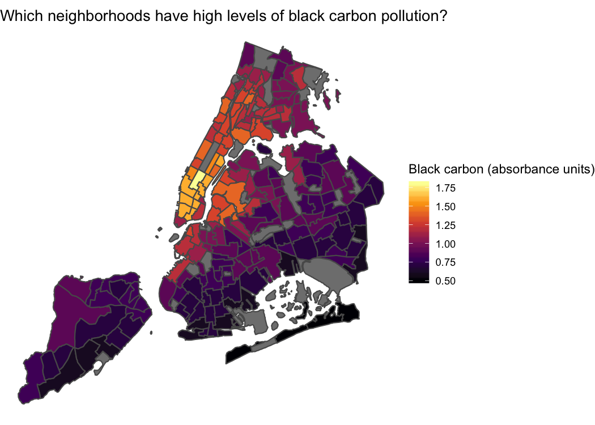

<!-- README.md is generated from README.Rmd. Please edit that file -->

# nycgeo

[](https://travis-ci.org/mfherman/nycgeo)
[](https://www.tidyverse.org/lifecycle/#experimental)
[](https://cran.r-project.org/package=nycgeo)

The `nycgeo` package contains spatial data files for various geographic
and administrative boundaries in New York City as well as tools for
working with NYC spatial data. Data is in the [`sf` (simple
features)](https://r-spatial.github.io/sf/) format and includes
boundaries for boroughs (counties), public use microdata areas (PUMAs),
community districts (CDs), neighborhood tabulation areas (NTAs), census
tracts, and census blocks. In the future, more boundaries will be added,
such as city council districts, school districts, and police precincts.

Additionally, selected demographic, social, and economic estimates from
the U.S. Census Bureau American Community Survey can be added to the
geographic boundaries in `nycgeo`, allowing for contextualization and
easy choropleth mapping. Finally, `nycgeo` makes it simple to access a
subset of spatial data in a particular geographic area, such as all
census tracts in Brooklyn and Queens.

## Why `nycgeo`?

The spatial files contained in the `nycgeo` package are available on
websites such as the [New York City Department of City Planning’s Bytes
of the Big
Apple](https://www1.nyc.gov/site/planning/data-maps/open-data.page#district_political)
and the [U.S. Census Bureau TIGER/Line®
Shapefiles](https://www.census.gov/geo/maps-data/data/tiger-line.html),
but this package aims to make accessing the spatial data more
convenient. Instead of downloading and converting shapefiles each time
you need them, `nycgeo` provides the files in a consistent format (`sf`)
with added metadata that enable joins with non-spatial data.

Other R packages share some features with `nycgeo`. In particular, the
wonderful [`tidycensus`](https://walkerke.github.io/tidycensus/) package
can access the Census Bureau’s API and download ACS estimates as well as
TIGER/Line® Shapefiles (via
[`tigris`](https://github.com/walkerke/tigris)).

One difference between the boundaries included here and the TIGER/Line®
Shapefiles available through `tigris` is that these boundaries are
clipped to the shoreline, allowing for better mapping of New York City.
Additionally, `nycgeo` contains boundaries for geographic areas that are
not available from the Census Bureau. This includes neighborhood
tabulation areas (NTAs) and community districts (CDs).

Finally, all spatial data included in the package uses the [NAD83 / New
York Long Island (ftUS) State Plane projected coordinate system
(EPSG 2263)](https://epsg.io/2263), which is the standard projection
used by New York City government agencies.

## Installation

You can install `nycgeo` from
[GitHub](https://https://github.com/mfherman/nycgeo) with:

``` r
remotes::install_github("mfherman/nycgeo")
```

## Examples

### Basic Usage

The most basic usage of `nycgeo` is to get boundaries in the `sf`
format. Use `nyc_boundaires()` to get your desired geography. To make
best use of the package, you should also load the `sf` package when
using `nycgeo`. For these examples, I’ll also load `tidyverse` as this
will allow us to take advantage of pretty `tibble` printing and will
come in handy when we want to manipulate and map the spatial data later.

``` r
library(nycgeo)
library(sf)
library(tidyverse)

nyc_boundaries(geography = "tract")
#> Simple feature collection with 2166 features and 12 fields
#> geometry type:  MULTIPOLYGON
#> dimension:      XY
#> bbox:           xmin: 913180.2 ymin: 120131.4 xmax: 1067382 ymax: 272798.5
#> epsg (SRID):    2263
#> proj4string:    +proj=lcc +lat_1=41.03333333333333 +lat_2=40.66666666666666 +lat_0=40.16666666666666 +lon_0=-74 +x_0=300000.0000000001 +y_0=0 +ellps=GRS80 +towgs84=0,0,0,0,0,0,0 +units=us-ft +no_defs
#> # A tibble: 2,166 x 13
#>    geoid boro_tract_id state_fips county_fips tract_id county_name
#>    <chr> <chr>         <chr>      <chr>       <chr>    <chr>      
#>  1 3606… 1000100       36         061         000100   New York   
#>  2 3606… 1000201       36         061         000201   New York   
#>  3 3606… 1000202       36         061         000202   New York   
#>  4 3606… 1000500       36         061         000500   New York   
#>  5 3606… 1000600       36         061         000600   New York   
#>  6 3606… 1000700       36         061         000700   New York   
#>  7 3606… 1000800       36         061         000800   New York   
#>  8 3606… 1000900       36         061         000900   New York   
#>  9 3606… 1001001       36         061         001001   New York   
#> 10 3606… 1001002       36         061         001002   New York   
#> # ... with 2,156 more rows, and 7 more variables: boro_name <chr>,
#> #   boro_id <chr>, nta_id <chr>, nta_name <chr>, puma_id <chr>,
#> #   puma_name <chr>, geometry <MULTIPOLYGON [US_survey_foot]>
```

### Filter by geography

If you don’t need census tracts for the entire city, you can use the
`filter_by` and `region` arguments of `nyc_boundaries()` to specify the
area you are interested in. For example, the following code returns only
census tracts in Brooklyn and Queens.

``` r
bk_qn_tracts <- nyc_boundaries(
  geography = "tract",
  filter_by = "borough",
  region = c("brooklyn", "queens")
  )

ggplot(bk_qn_tracts) +
  geom_sf() +
  theme_minimal()
```


Note, you can select multiple regions by passing a character vector to
the `region` argument, but you can only choose a single geography to
`filter_by`. Additionally, you can only filter by a geography that is
*larger than or equal to* the boundaries you request. For example, it is
not possible to filter PUMAs by NTAs because NTAs are smaller than
PUMAs.

### Adding American Community Survey Data

`nycgeo` includes selected estimates from the American Community Survey
as datasets. You can access these datasets directly or have them
appended to the spatial data. To print a `tibble` of ACS data, simply
call the data you want.

``` r
ntas_acs_data
#> # A tibble: 195 x 27
#>    nta_id pop_total_est pop_total_moe pop_white_est pop_white_moe
#>    <chr>          <dbl>         <dbl>         <dbl>         <dbl>
#>  1 BK09           24212          891.         17734          859.
#>  2 BK17           67681         1736.         43146         1449.
#>  3 BK19           35811         1388.         24817         1139.
#>  4 BK21           31132         1268.          9804          894.
#>  5 BK23           16436          707.         15380          698.
#>  6 BK25           45031         1498.         33709         1346.
#>  7 BK26           30828         1480.         14676          961.
#>  8 BK27           32808         1293.         14483          863.
#>  9 BK28           93114         2087.         38709         1559.
#> 10 BK29           66055         1757.         29318         1293.
#> # ... with 185 more rows, and 22 more variables: pop_white_pct_est <dbl>,
#> #   pop_white_pct_moe <dbl>, pop_black_est <dbl>, pop_black_moe <dbl>,
#> #   pop_black_pct_est <dbl>, pop_black_pct_moe <dbl>, pop_hisp_est <dbl>,
#> #   pop_hisp_moe <dbl>, pop_hisp_pct_est <dbl>, pop_hisp_pct_moe <dbl>,
#> #   pop_asian_est <dbl>, pop_asian_moe <dbl>, pop_asian_pct_est <dbl>,
#> #   pop_asian_pct_moe <dbl>, pop_ba_above_est <dbl>,
#> #   pop_ba_above_moe <dbl>, pop_ba_above_pct_est <dbl>,
#> #   pop_ba_above_pct_moe <dbl>, pop_inpov_est <dbl>, pop_inpov_moe <dbl>,
#> #   pop_inpov_pct_est <dbl>, pop_inpov_pct_moe <dbl>
```

To add census estimates to an `sf` object, use `add_acs_data = TRUE` to
an `nyc_boundaries()`call. For example, here we get all NTAs in
Manhattan with ACS data appended. One convenience of having the ACS data
joined to the `sf` object is that you can very simply make a choropleth
map. Here we do it with `ggplot2`, but you could use `tmap`, `leaflet`
or any other spatial package that works with `sf` objects.

``` r
mn_ntas <- nyc_boundaries(
  geography = "nta",
  filter_by = "borough",
  region = "manhattan",
  add_acs_data = TRUE
  )

ggplot(mn_ntas) +
  geom_sf(aes(fill = pop_ba_above_pct_est)) +
  scale_fill_viridis_c(
    name = "Bachelor's or above",
    labels = scales::percent_format(),
    option = "magma"
    ) +
  theme_void() +
  theme(panel.grid = element_line(color = "transparent")) +
  labs(title = "Which neighborhoods in Manhattan are most educated?")
```


### Joining with other data

One use case of `nycgeo()` is if you have non-spatial data that relates
to census tracts, NTAs, or other geographies and need to join that data
with spatial boundaries to plot or otherwise analyze. This non-spatial
data may be coded in a variety of ways and might not have names or IDs
that match your spatial data. The `sf` data provided in `nycgeo` seeks
to have a variety of geographic metadata that will match whatever labels
your non-spatial data has.

In this example, we have non-spatial data from the [NYC Neighborhood
Health
Atlas](https://www1.nyc.gov/site/doh/health/neighborhood-health/nyc-neighborhood-health-atlas.page)
at the NTA-level from which we would like to make a choropleth map. To
do this, we import the .csv file and then join it to the spatial NTA
object matching on NTA IDs. Then, we can map it as in the above
example.

``` r
nta_health <- read_csv("https://raw.githubusercontent.com/mfherman/nycgeo/master/inst/extdata/nta-health.csv") %>% 
  select(NTA_Code, BlackCarbon)

nyc_boundaries(geography = "nta") %>% 
  left_join(nta_health, by = c("nta_id" = "NTA_Code")) %>% 
  ggplot() +
  geom_sf(aes(fill = BlackCarbon)) +
  scale_fill_viridis_c(name = "Black carbon (absorbance units)", option = "inferno") +
  theme_void() +
  theme(panel.grid = element_line(color = "transparent")) +
  labs(title = "Which neighborhoods have high levels of black carbon pollution?")
```



### Finding which districts a set of points lies within

[Point-in-polygon
operations](https://en.wikipedia.org/wiki/Point_in_polygon) are common
tasks for spatial analysis. Given a set of points we want to find out
which polygon contains each point. A real-world application of this
would be counting the number of schools in each community district.

We start with a (non-spatial) data frame of all schools in New York, but
with columns for latitude and longitude. Then we use those latitudes and
longitudes to convert the data frame to an sf object. From there, we can
use the `nyc_point_poly()` function to find which community district
(CD) each point (school) is in and then count by CD to get the total
number of schools in each
CD.

``` r
nyc_schools <- read_csv("https://raw.githubusercontent.com/mfherman/nycgeo/master/inst/extdata/nyc-schools.csv")

schools_sf <- nyc_schools %>% 
  st_as_sf(
    coords = c("longitude", "latitude"),
    crs = 4326,
    stringsAsFactors = FALSE
    )

nyc_point_poly(schools_sf, "cd") %>% 
  count(cd_name, boro_cd_id)
#> Simple feature collection with 60 features and 3 fields
#> geometry type:  MULTIPOINT
#> dimension:      XY
#> bbox:           xmin: 916396.5 ymin: 124365.2 xmax: 1064985 ymax: 268476.4
#> epsg (SRID):    2263
#> proj4string:    +proj=lcc +lat_1=41.03333333333333 +lat_2=40.66666666666666 +lat_0=40.16666666666666 +lon_0=-74 +x_0=300000.0000000001 +y_0=0 +ellps=GRS80 +towgs84=0,0,0,0,0,0,0 +units=us-ft +no_defs
#> # A tibble: 60 x 4
#>    cd_name        boro_cd_id     n                                 geometry
#>    <chr>          <chr>      <int>            <MULTIPOINT [US_survey_foot]>
#>  1 Bronx Communi… 201           69 (1003585 236685.3, 1003631 236498.4, 10…
#>  2 Bronx Communi… 210           32 (1026709 243584.3, 1027247 245514.1, 10…
#>  3 Bronx Communi… 211           41 (1020487 252890.4, 1021243 250000.9, 10…
#>  4 Bronx Communi… 212           36 (1020793 257962.4, 1020959 266963.4, 10…
#>  5 Bronx Communi… 202           29 (1011396 236619.2, 1011409 237210.2, 10…
#>  6 Bronx Communi… 203           72 (1009859 239268.8, 1009929 238798.2, 10…
#>  7 Bronx Communi… 204           67 (1003566 243240.8, 1004050 244001.9, 10…
#>  8 Bronx Communi… 205           43 (1006177 250083.5, 1006725 249559.7, 10…
#>  9 Bronx Communi… 206           55 (1012222 247610, 1012310 247057.8, 1012…
#> 10 Bronx Communi… 207           34 (1009189 252317.2, 1010176 252453.8, 10…
#> # ... with 50 more rows
```
